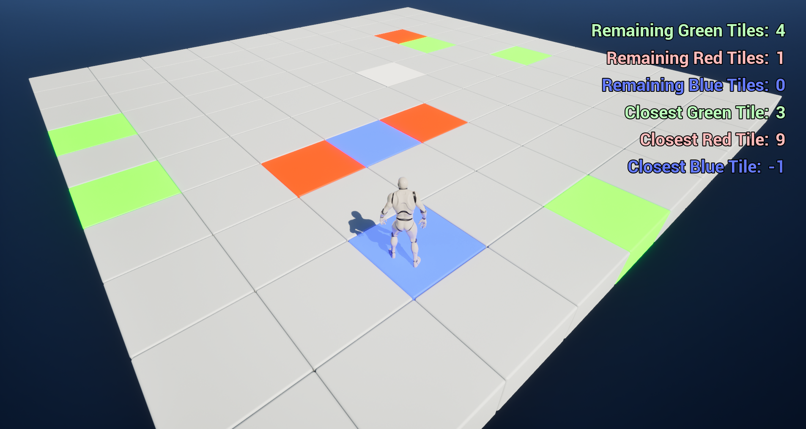
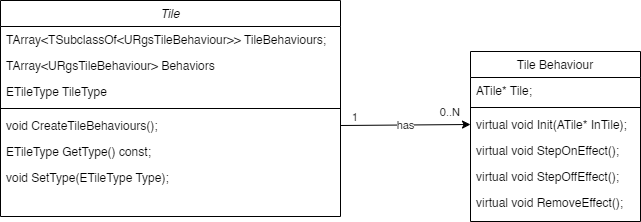

# Tile Adventure

Tiles Adventure is a personal project centered around gameplay programming using Unreal Engine 5 and C++. The project embodies a paradigm of component-based programming, ensuring modularity and extensibility of the codebase. Adhering to the principles of clean code, I structured the implementation to be easily understandable and maintainable. Crucially, I designed a customizable interface empowering game designers to autonomously iterate on gameplay mechanics. This project not only showcases technical proficiency but also underscores a commitment to fostering collaborative game development environments.

## Game overview
Set in a world of platforms and tiles, the player is tasked with exploring and completing specific objectives.
The main goal is to find all the green tiles scattered throughout the game world while carefully avoiding the red ones. Green tiles serve as the focal point of the game, while red ones are to be avoided at all costs. Normal tiles are gray but change color when the player steps on them, providing visual feedback.
The gameplay revolves around the player's movement on a grid of tiles. Each time the player moves onto a tile, it can react differently: turning green if it's the goal to reach, red if it's to be avoided, or blue if it's a special tile that reveals the location of undiscovered green tiles.
The game ends when the player has found all the green tiles or has stepped on all the red ones. In either case, a game-over screen is displayed. After a brief interval, the game resets automatically, bringing the player back to the initial screen for a new game.

## Tiles

Instead of using inheritance, the tile has been modeled using composition. Each different tile type (Green, Blue, Red, and Silver) exhibits distinct behaviors by design. These behaviors have been meticulously analyzed and abstracted, enabling their encapsulation within a singular Tile Behavior class. Each tile maintains an array of behaviors triggered upon *'Step On'* and *'Step Off'* events, detected via interactions with a Box Collider. This collider captures 'Begin Overlap' and 'End Overlap' events with the player pawn.

Those behaviors are instantiated during the *BeginPlay(*) method of the Tile class. This process involves creating new instances of the *TSubclassOf<URgsTileBehaviour>* class, which are then assigned to a specific Tile blueprint. 

The *CreateTileBehaviours()* method within the Tile class facilitates this initialization.
For each *TSubclassOf<URgsTileBehaviour>* specified in the TileBehaviours array, a new instance of the corresponding behavior class is created. Subsequently, the *Init()* method of the newly created behavior instance is called to initialize it, and the instance is added to the Behaviours array for further processing. If any instantiation fails, a warning message is logged to provide feedback on potential issues.

Each behaviour can, eventually, implement three methods of the base class:
- **StepOnEffect()** Called when the character steps on tiles with this behavior. Child behaviors can implement this method to apply desired effects, like triggering a visual effect or communicating with the game mode.
- **StepOffEffect()** Called when the character leaves tiles with this behavior. Child behaviors can implement this method to remove effects applied when stepping on tiles.
- **RemoveEffect()** Called to completely remove effects applied by this behavior.

Three tile behaviours have been implemented:
- **URgsTileColorBehaviour:**
This behavior manages the visual color change of a tile when the character steps on it. During the StepOnEffect() method, the tile's color is modified using a custom material. When the character steps off the tile, the StepOffEffect() method reverts the tile's color to its default. The RemoveEffect() method completely cleans up any applied effects when the tile is no longer needed.

- **URgsRevealTileBehaviour:**
This behavior is responsible for revealing tiles of a specific type  when the character steps on it. During the StepOnEffect() method, the behavior signals the GameMode to reveal the specified type of tile. When the character steps off the tile, the StepOffEffect() method signals the GameMode to hide the revealed tile type again.

- **URgsTileFoundableBehaviour:**
This behavior handles the logic of finding a tile when the character steps on it. During the StepOnEffect() method, the behavior signals the GameMode that the tile has been found. Once found, the tile cannot be found again.

The use of behaviors ensures a complete decoupling between the Tile type assigned in the Tile Instance and its behaviors. Therefore, the system increases its extensibility, allowing, for example, a green tile to reveal all the blue tiles without further coding. Additionally, adding a new TileType to the ETileType enum will not require any refactoring in the current behaviors, and it can easily reuse the behaviors without any modification. This approach also enhances the accessibility of the code for game designers. In a real-world scenario, they would find it easier to interact with the system independently, without needing programmers' intervention for modifications to the tile behaviors. This autonomy is facilitated by the reuse and recombination of existing behaviors.

## Game mode
I opted for generalization by implementing a single method: *GetTilesPerTypeFound(ETileType type)*. This approach allows for the addition of a new type to the *ETileType* enum without the need to add a new method in the GameMode class. Furthermore, it helps maintain a minimal number of lines in the class, resulting in improved readability. The same thing has been done to implement the method to calculate the distance to the closest tile
*GetClosestTileDistancePerType(ETileType TileType)*. Those changes required the HUD and EndScreen blueprint classes to be modified.

To provide an interface for indicating when a tile has been found or when a specific type of tile needs to be revealed (to implement the behavior for Blue tiles), I decided to use delegates. The *ARgsTileGameMode* class has two public delegates that tile behaviors use to communicate with the Game Mode: *OnTileFound* and *OnTypeVisibilityToggle*.
